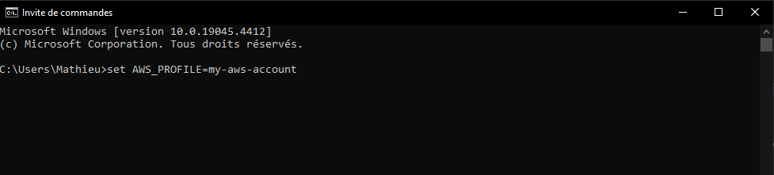
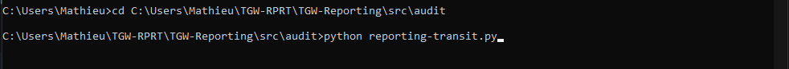

# TGW-Reporting 🔌
Little **Open-Source** python script to report transit-gateways of aws account(s).

## Main features 🧙
- List in a python list ***all of the TGW in a AWS acc***.
- Creates output files in .json and .r format 
- **Strong unit testing** for the account 

## Configuration 🛠
- Python **3.12** 
- Boto3 **1.3.4** 
- R **4.2** 

## Installation ⚙️
Firstly, you can **clone the repository** by running 

`git clone https://github.com/MathieuAudibert/TGW-Reporting` or `gh repo clone MathieuAudibert/TGW-Reporting`

Everything that is needed is in the requirements.txt file. Just run it by using this command :

`pip install -r requirements.txt` or `cat requirements.txt | xargs npm install -g`

## Usage Tutorial 💡
Firstly, you must have a get_credentials.txt script wich will do a assume-role of the aws account(s) you are using. 

- Once this is set-up, in a cmd you run this command : `set AWS_PROFILE=whatever-aws-acc`

- Then, once you are in the good folder, simply run the report 😎 `python reporting-transit.py`

- **And you're done** ! You can acces your files in the *./src/audit/output-files* folder

## Contact 📞
If you need have any questions/need help/whatever here is my mail :

<ins> **mathieu.audibert@efrei.net** </ins>
